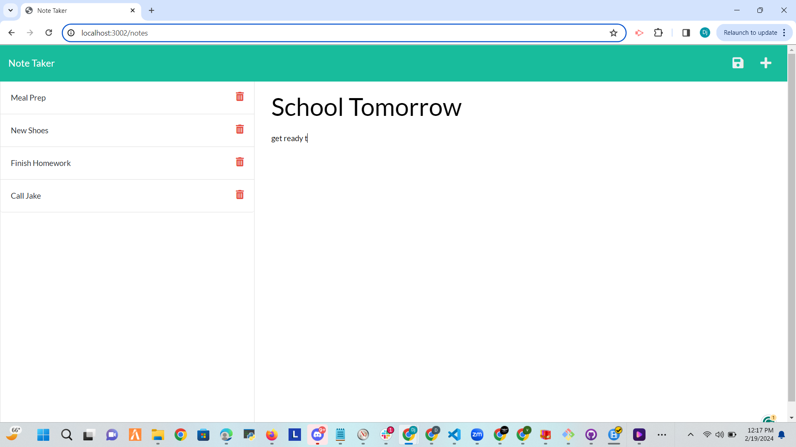

# Devonte Miller's Note Taker App

## Description
This project is a locally hosted browser-based note-taking application built with Node.js and Express.js. It offers intuitive functionality, allowing users to easily create, save, and delete notes. Users can simply title their notes, add text, click save, and their notes are stored for future reference. Additionally, there's a convenient delete button to remove completed ideas.

## Technologies
- Node.js
- Express.js
- Heroku (for live deployment)

## Challenges
- Deploying a page using Heroku
- Learning about and implementing different routes

## Future Implementations
- Calendar integration
- Note sharing between users/teams
- Setting email alerts for time-sensitive notes
- Note body preview underneath title

## User Story
As a busy student balancing gym sessions and school assignments, I need a simple way to jot down notes about my workouts, shoe preferences, and upcoming tests. This app will help me stay organized and focused on my fitness goals while keeping track of important academic deadlines.

## Demonstration

## Installation
To install the application on your local machine, follow these steps:
1. Clone the provided repository.
2. Run `npm install` to install dependencies.
3. Run `npm start` to initiate the server in your terminal.
4. Visit http://localhost:3002/ in your browser. The default port provided is 3002.

## License

## Author
Devonte Miller
